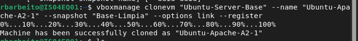
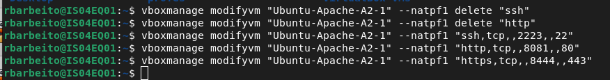
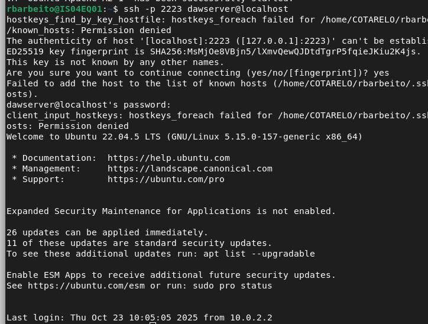
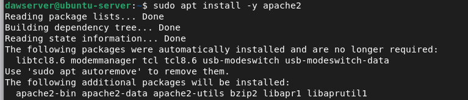

# despr2_1_apache

# Descripción
Instalación y configuración de Apache en una máquina virtual y despliegue de un sitio web estatico.

# Pasos

## 1. Creamos la VM

## 2. Preparación del entorno

## 3. Desplegamos sitio de ejemplo

